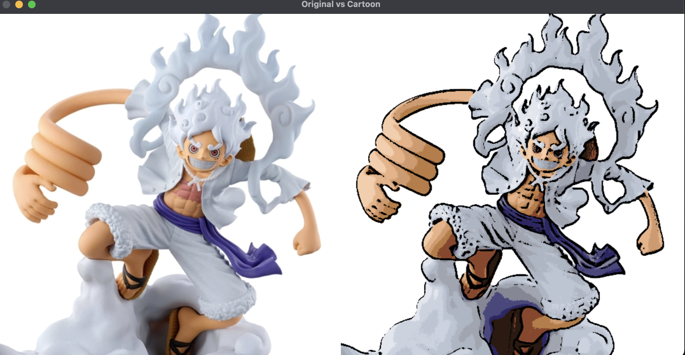
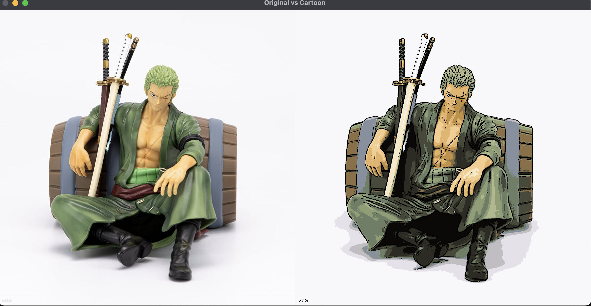

# 🎨 Cartoon_filter

OpenCV 기반 카툰 필터 프로젝트인 `Cartoon_filter`는 다음과 같은 주요 이미지 처리 기능들을 활용하여 일반 이미지를 만화 스타일로 변환합니다. 아래는 코드에서 사용된 주요 OpenCV 함수들과 그 기능에 대한 설명입니다.

---

## ✅ 주요 OpenCV 함수 설명

### 1. `cv2.cvtColor()`
```python
cv2.cvtColor(image, cv2.COLOR_RGB2GRAY)
```
- 이미지를 RGB에서 그레이스케일로 변환합니다.
- 카툰 필터에서는 엣지(윤곽선)를 검출하기 위해 컬러 대신 밝기만 남기는 흑백 이미지가 필요합니다.

---

### 2. `cv2.medianBlur()`
```python
cv2.medianBlur(gray, 7)
```
- 중간값 필터를 적용하여 이미지의 노이즈를 제거합니다.
- 특히 점처럼 생긴 salt-and-pepper 노이즈에 효과적입니다.

---

### 3. `cv2.adaptiveThreshold()`
```python
cv2.adaptiveThreshold(gray, 255, cv2.ADAPTIVE_THRESH_MEAN_C, cv2.THRESH_BINARY, 7, 5)
```
- 밝기값에 따라 자동으로 임계값을 계산하여 윤곽선을 검출합니다.
- Adaptive Threshold는 조명 변화가 있는 이미지에서도 경계를 잘 잡아낼 수 있습니다.

---

### 4. `cv2.kmeans()`
```python
cv2.kmeans(data, k, None, criteria, 10, cv2.KMEANS_RANDOM_CENTERS)
```
- 이미지의 색상을 K개의 대표 색상으로 압축합니다 (색상 팔레트 축소).
- 만화 스타일의 단순하고 평탄한 색 영역을 생성하기 위해 사용됩니다.

---

### 5. `cv2.bitwise_and()`
```python
cv2.bitwise_and(quantized, quantized, mask=edges)
```
- 윤곽선 마스크와 색상 이미지를 결합하여, 엣지가 있는 부분만 살려주는 효과를 줍니다.
- 만화의 테두리 효과를 구현하는 핵심 단계입니다.

---

### 6. `cv2.bilateralFilter()`
```python
cv2.bilateralFilter(image, 7, 50, 50)
```
- 경계는 유지하면서 내부 색상을 부드럽게 블러링하는 고급 필터입니다.
- Bilateral Filter는 일반 Blur와 달리 윤곽을 흐리지 않아 만화 효과에 적합합니다.

---

### 7. `cv2.imshow()` / `cv2.waitKey()` / `cv2.destroyAllWindows()`
```python
cv2.imshow("Cartoon Filter", cartoon_bgr)
cv2.waitKey(0)
cv2.destroyAllWindows()
```
- 필터 결과를 OpenCV 창에서 실시간으로 확인할 수 있게 해줍니다.
- `waitKey(0)`는 키 입력을 대기하며, `destroyAllWindows()`는 모든 창을 닫습니다.

---

## 🧠 전체 흐름 요약
1. 이미지를 불러와 RGB → 그레이스케일로 변환
2. Median Blur로 노이즈 제거
3. Adaptive Threshold로 엣지 추출
4. K-means로 색상 축소
5. 어두운 부분 강조
6. 윤곽선과 색상을 결합하여 카툰 효과 생성
7. Bilateral Filter로 부드러운 마무리 처리

---

## 🖼️ 필터 결과 비교 및 한계

아래 두 이미지는 각각 카툰 필터 적용 결과입니다. 둘 사이의 품질 차이를 통해 필터의 한계와 영향을 확인할 수 있습니다.


- **첫 번째 이미지**는 엣지 검출이 약하고, 색상 대비가 적어 만화 느낌이 약하게 표현되었습니다.
  - 이유: 배경과 피규어의 색상이 밝고 부드러워 엣지가 잘 구분되지 않음
  - 윤곽선이 얇거나 끊겨 만화 특유의 테두리 느낌이 덜함


- **두 번째 이미지**는 엣지가 뚜렷하고 색상 대비도 강해 만화 스타일이 잘 표현되었습니다.
  - 이유: 명암 대비가 크고 경계가 뚜렷한 구조 덕분에 adaptive threshold와 k-means가 효과적으로 작동함

### 📌 알고리즘의 한계
- 입력 이미지의 **조명**, **색상 대비**, **윤곽의 뚜렷함**에 따라 결과가 크게 달라질 수 있음
- `adaptiveThreshold()`는 배경이 너무 밝거나 텍스처가 부족하면 윤곽선을 제대로 검출하지 못함
- `k-means`는 색상을 단순화하지만, 너무 높은 K값은 만화 느낌을 약화시킬 수 있음
- 단순한 edge-based 방식이므로 그림자/광택 표현은 만화처럼 자연스럽게 처리되지 않음

